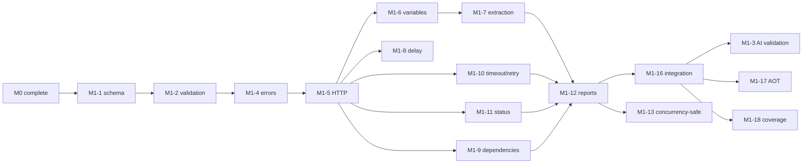

# Milestone 1 — Core Engine: Task Specification

> **Status:** v1.1 · 2026-08-27  
> **Purpose:** Defines the concrete engineering tasks required to deliver **Milestone 1 — Core Engine**.  
> **Tracking:** Task IDs and status checkboxes live in `ROADMAP.md` §5. `ROADMAP.md` remains the single source of truth for task status.  
> **Inputs:** `README.md` (product vision, MVP, AI-friendly principles, Milestone 1 scope) · `ROADMAP.md` §2 (baseline audit) · `ROADMAP.md` §3 (ADRs).

---

## 1. Objective

Milestone 1 delivers the first usable Tyfapi core:

```text
Tyfapi YAML
    ↓
Validate
    ↓
Execute
    ↓
Real API
    ↓
Human + machine-readable result
```

The engine must:

- read and validate a simple, flat, **AI-friendly** YAML flow format;
- execute HTTP scenarios deterministically;
- support variables, extraction, delays and sequential dependencies;
- fail fast with contextual errors;
- work across environments;
- produce stable machine-readable results;
- publish as a self-contained Native AOT binary;
- provide enough structure for future CI/CD and load-testing work.

### Important product principle

Tyfapi is **AI-friendly, not AI-powered**.

There is no AI model, AI provider, AI API or agent runtime inside the product.

AI generation is validated as an **external compatibility experiment**: any LLM or coding agent should be able to generate Tyfapi YAML using the public schema and documentation.

---

## 2. MVP vs Engineering Scope

Milestone 1 has two distinct purposes.

### Product validation

The MVP must answer:

> **Do developers find it useful to define realistic API journeys in YAML, keep them in Git, and run them repeatedly?**

The minimum product loop is:

```text
YAML
 ↓
realistic flow
 ↓
variables / extraction
 ↓
HTTP execution
 ↓
assertion
 ↓
useful result
```

The strongest validation signal is repeated real-world usage:

```text
Developer tries Tyfapi
       ↓
Creates a second scenario
       ↓
Commits scenarios to Git
       ↓
Runs them again
       ↓
Uses them in CI
```

### Engineering quality

Milestone 1 also hardens the core with:

- deterministic validation;
- stable error semantics;
- tests;
- machine-readable reports;
- AOT publishing;
- concurrency-safe architecture;
- CI quality gates.

These are engineering goals, **not substitutes for product validation**.

---

## 3. Out of Scope

| Item | Deferred to |
|---|---|
| AI integration inside Tyfapi | Never required; external AI remains optional |
| VS Code extension / Webview UI | M2 |
| Visual editor | M2 |
| Bots / `--bots N` | M3 |
| Parallel workflow execution | M3 |
| Load metrics | M3 |
| AI error diagnostics | M3 |
| Cloud platform / dashboard | M4 |
| Distributed cloud load testing | M4 |
| User accounts / SaaS infrastructure | M4 |

M1 may make the engine **compatible with future concurrency**, but must not become a load-testing implementation.

---

## 4. Prerequisites

Milestone 0 must be complete.

- **M0-1…M0-3** — clean solution layout, exactly one entry point, CLI surface:
  - `tyfapi validate`
  - `tyfapi run`
- Stable exit codes:
  - `0` success
  - `1` execution failed
  - `2` validation failed
  - `3` usage error
- **M0-4** — AOT-safe deserialization strategy settled and proven.
- **M0-5** — zero-warning build with `TreatWarningsAsErrors=true` and reproducible pipeline script.
- **AD-6** — `depends_on` means strict validation + sequential execution in M1. Parallelism is deferred to M3.

---

## 5. Baseline Gaps This Milestone Must Close

| Gap | Fixed by |
|---|---|
| Missing functions / unmet dependencies can be silently skipped | M1-2, M1-4, M1-9 |
| No HTTP status validation | M1-11 |
| `settings.timeout` and `max_retries` parsed but unused | M1-10 |
| `FunctionDefinition.Baseurl` ignored | M1-5 |
| Content-Type handling incorrect for request bodies | M1-5 |
| `metadata.variables` and environment values not seeded | M1-6 |
| Extraction coerces values to strings | M1-7 |
| Unknown `${var}` silently becomes empty | M1-6 |
| Fake HTTP handler not actually injected in tests | M1-15 |
| Trivial assertions in tests | M1-14 |
| Native AOT broken by reflection-based YAML deserialization | M0-4, M1-17 |

---

## 6. Task Breakdown

Status legend:

`[ ]` TODO · `[~]` IN PROGRESS · `[x]` DONE · `[-]` DEFERRED · `[?]` NEEDS DECISION

### 6.1 Syntax & Validation

#### M1-1 — Formal Flow Schema Specification

**Goal:** Establish the authoritative, versioned definition of the Tyfapi YAML format.

**Description**

Produce:

```text
docs/flow-schema.md
```

containing prose documentation plus a machine-readable JSON Schema covering:

- `metadata`;
- `functions`;
- `workflow`;
- `settings`.

The schema must remain:

- flat;
- predictable;
- descriptive;
- easy for humans to read;
- easy for LLMs and coding agents to generate.

The schema is authoritative for the **current format**, but must remain versionable and evolvable. The first schema must not be treated as permanently frozen.

**Acceptance criteria**

- [ ] `docs/flow-schema.md` exists.
- [ ] JSON Schema is machine-consumable.
- [ ] Examples validate against the schema.
- [ ] Defaults are documented.
- [ ] Schema versioning strategy is documented.
- [ ] No unnecessary nesting is introduced merely for implementation convenience.

**Dependencies:** M0-4.

---

#### M1-2 — `tyfapi validate`: Schema + Semantic Validation

**Goal:** Make invalid scenarios fail before execution and provide errors useful to both humans and AI agents.

Implement:

```bash
tyfapi validate ./flow.yaml
```

Validation occurs in two stages:

1. Schema validation.
2. Semantic validation.

Checks include:

- workflow references an undefined function;
- `depends_on` references an unknown step;
- dependency cycles;
- duplicate variable definitions where prohibited;
- malformed JSONPath;
- invalid HTTP method;
- invalid/missing endpoint;
- invalid delay;
- invalid required fields.

Every error must identify its location.

Example:

```text
workflow[3] → depends_on: unknown step 'CreateCart'
```

A flow that fails validation must not execute.

`run` must invoke the same validation before execution.

**Acceptance criteria**

- [ ] One negative test per semantic validation rule.
- [ ] Errors contain precise element paths.
- [ ] `run` refuses invalid flows.
- [ ] Exit code is `2`.

**Dependencies:** M1-1, M0-3.

---

#### M1-3 — AI-Generation Compatibility Validation

**Goal:** Verify that the format is genuinely easy for external AI tools to generate.

This is a **validation experiment, not an AI feature**.

Use at least two general-purpose AI systems, initially GPT and Claude, to convert at least three real OpenAPI/Swagger specifications into Tyfapi scenarios.

For every generated scenario:

```text
OpenAPI
  ↓
External AI
  ↓
Tyfapi YAML
  ↓
tyfapi validate
  ↓
tyfapi run
```

No manual editing should be allowed before validation/execution.

Record:

- prompt;
- source specification;
- generated YAML;
- validation result;
- execution result;
- semantic usefulness;
- recurring generation problems.

Store the experiment in:

```text
docs/ai-validation.md
```

A generated file is not considered successful merely because it parses. Evaluate:

1. syntax success;
2. execution success;
3. semantic usefulness.

Systematic friction should trigger a review of the schema or diagnostics. Isolated model mistakes should not automatically trigger schema changes.

**Acceptance criteria**

- [ ] At least 3 real OpenAPI specs tested with GPT.
- [ ] At least 3 real OpenAPI specs tested with Claude.
- [ ] Generated files validate without manual correction.
- [ ] Generated files execute successfully against an appropriate test/mock API.
- [ ] Each scenario is reviewed for semantic usefulness.
- [ ] `docs/ai-validation.md` contains prompts, inputs, outputs and results.

**Dependencies:** M1-1, M1-2, M1-5…M1-7, M1-16.

---

#### M1-4 — Error Model

**Goal:** Guarantee that failures are contextual, deterministic and machine-readable.

Define typed errors such as:

- `FlowValidationError`
- `ExecutionError`

`FlowValidationError` should include:

- offending path;
- relevant field/function/step;
- useful diagnostic message;
- suggested fix where practical.

`ExecutionError` should include:

- step;
- function;
- method;
- URL;
- non-sensitive request context;
- response status;
- response body where available;
- retry information where applicable.

Fail-fast is mandatory:

> The first failing step aborts the flow.

Sensitive values such as passwords and secrets must not be leaked into errors or reports.

**Acceptance criteria**

- [ ] No known failure path silently succeeds or skips work.
- [ ] Errors identify the relevant scenario element.
- [ ] Errors can be serialized to JSON.
- [ ] Sensitive values are excluded from error payloads.
- [ ] Exit codes remain stable.

**Dependencies:** M0-3.

---

### 6.2 Execution Engine

#### M1-5 — HTTP Step Execution

**Goal:** Correct and observable HTTP execution.

Required methods:

```text
GET
POST
PUT
DELETE
```

PATCH and HEAD may be implemented as low-cost extensions, but are not required for MVP validation.

Requests support:

- per-function base URL;
- endpoint;
- headers;
- request body;
- Authorization;
- query parameters where supported.

`baseurl` must be respected per function.

Content-Type handling must be correct:

- explicit header wins;
- JSON bodies receive an appropriate default when applicable;
- headers are never silently discarded.

HTTP dependencies must be injectable for deterministic testing.

**Acceptance criteria**

- [ ] Fake-handler tests assert exact method, URL, headers and body.
- [ ] Per-function `baseurl` is respected.
- [ ] JSON Content-Type is correct.
- [ ] Explicit Content-Type overrides work.
- [ ] No engine code constructs uncontrolled HTTP clients.

**Dependencies:** M0-4, M1-4.

---

#### M1-6 — Variable Engine

**Goal:** Provide a predictable variable model.

Support:

```text
${variable}
```

in:

- endpoint;
- headers;
- body.

Variables come from:

1. `--set`
2. environment file
3. `metadata.variables`

with the precedence defined by AD-5.

Extracted values overwrite existing variables when explicitly extracted.

Unknown variables must fail:

```text
ExecutionError:
unknown variable 'token' in workflow step 'GetProfile'
```

They must never silently become an empty string.

**Acceptance criteria**

- [ ] Precedence rules are tested.
- [ ] Extraction-overwrite behavior is tested.
- [ ] Unknown-variable failure identifies variable and step.

**Dependencies:** M1-4, M1-5.

---

#### M1-7 — Extraction Engine

**Goal:** Provide reliable data flow between steps.

Initial JSONPath support:

```text
$.token
$.user.id
$.items[0].name
```

Support:

- strings;
- numbers;
- booleans;
- nested objects;
- arrays.

Multiple values may be extracted from one response.

Missing paths and invalid JSON must produce contextual execution errors.

**MVP rule:**

> A required extraction that cannot resolve is a failed step.

This provides basic response-content validation without requiring a generic assertion DSL in M1.

A richer assertion language may be introduced later.

**Acceptance criteria**

- [ ] Tests cover string, number, boolean, nested object and array values.
- [ ] Missing path fails the step.
- [ ] Invalid JSON fails the step when extraction requires JSON.
- [ ] Login token extraction reaches the next request's Authorization header.

**Dependencies:** M1-5, M1-6.

---

#### M1-8 — DELAY Steps

**Goal:** Support deterministic pacing between requests.

Example:

```yaml
- type: DELAY
  duration_seconds: 0.5
```

Requirements:

- decimal durations;
- cancellation-aware waiting;
- no busy waiting;
- sensible upper bound validation.

**Acceptance criteria**

- [ ] Delay test verifies approximate elapsed time.
- [ ] Cancellation interrupts the delay.
- [ ] Invalid delay values are rejected by validation.

**Dependencies:** M1-5.

---

#### M1-9 — `depends_on`

**Goal:** Make dependencies meaningful and deterministic.

In M1:

> `depends_on` means validation + sequential execution.

Parallel execution is deferred to M3.

Requirements:

- unknown dependency → validation error;
- cyclic dependency → validation error;
- unmet runtime dependency → execution error;
- execution follows dependency order.

**Acceptance criteria**

- [ ] Cycle detection test.
- [ ] Unknown-reference test.
- [ ] Valid dependency-order test.
- [ ] No dependency can be silently skipped.

**Dependencies:** M1-2, M1-4, M1-5.

---

#### M1-10 — Timeouts & Retries

**Goal:** Make execution settings operational.

Implement:

- per-request timeout;
- overall run timeout;
- configurable retries.

Initial retry cases:

- 429;
- 5xx;
- timeout.

Honor `Retry-After` for 429 when present.

Keep the policy simple and deterministic. Retry behavior is supporting infrastructure, not a core product differentiator.

**Acceptance criteria**

- [ ] Retry count is respected.
- [ ] Timeout is enforced.
- [ ] Retry attempts are represented in the result.
- [ ] 429/5xx/timeout behavior is tested.
- [ ] No retry occurs when `max_retries = 0`.

**Dependencies:** M1-4, M1-5.

---

#### M1-11 — Response Policy

**Goal:** Make failed HTTP calls produce failed scenarios.

Support:

```yaml
expected_status: 200
```

Default behavior:

> Any 2xx response passes unless otherwise specified.

Mismatch produces an `ExecutionError` containing expected status, received status and response body where safe.

**Acceptance criteria**

- [ ] Expected 200 / received 403 fails.
- [ ] Error includes status and body.
- [ ] 201 and 204 pass under default 2xx behavior.
- [ ] 4xx/5xx fail by default.

**Dependencies:** M1-4, M1-5.

---

### 6.3 Output & Future-Proofing

#### M1-12 — Console UX & JSON Reports

**Goal:** Serve both the human developer and automation.

Example:

```text
step 1/3 · LoginUser · 200 · 182ms
step 2/3 · GetProfile · 200 · 43ms
step 3/3 · CreateCart · 201 · 91ms

PASS · 3/3 steps · 316ms
```

Machine-readable output:

```bash
tyfapi run ./flow.yaml --format json
```

The JSON report must be stable and versioned.

Include:

- flow metadata;
- overall status;
- per-step status;
- timings;
- HTTP status;
- extracted variable names;
- retry information;
- contextual failure payloads.

This is important for future CI and for external AI agents consuming Tyfapi results. It does **not** require AI inside Tyfapi.

**Acceptance criteria**

- [ ] `docs/json-report-schema.md` exists.
- [ ] Report validates against its own schema.
- [ ] Console output is tested.
- [ ] Failure reports contain useful context.
- [ ] Secrets are not emitted.

**Dependencies:** M1-4…M1-11.

---

#### M1-13 — Concurrency-Safe Architecture

**Goal:** Ensure M3 load execution will not require rewriting the core.

M1 does **not** implement load testing.

Requirements:

- no static mutable execution state;
- asynchronous I/O;
- isolated variable state per execution;
- injectable HTTP handler;
- no hidden singleton state coupling executions.

Document the design in:

```text
docs/architecture.md
```

The objective is:

> **Do not prevent future concurrency.**

It is not:

> **Build the load-testing architecture now.**

**Acceptance criteria**

- [ ] `docs/architecture.md` committed.
- [ ] Multiple executor instances can run concurrently without state contamination.
- [ ] Per-execution variables remain isolated.
- [ ] No `--bots` implementation exists in M1.

**Dependencies:** M1-5…M1-12.

---

### 6.4 Tests & Quality Gates

#### M1-14 — Unit Tests: Parser + Validator

**Goal:** Make the format and validation behavior executable specifications.

Tests cover:

- schema rules;
- semantic validation;
- dependency validation;
- variable validation;
- JSONPath validation.

**Acceptance criteria**

- [ ] No trivial assertions.
- [ ] Negative tests exist for every semantic validation rule.
- [ ] Tests assert actual values, errors or exit codes.

**Dependencies:** M1-1, M1-2, M1-7.

---

#### M1-15 — Engine Unit Tests

**Goal:** Pin engine behavior to deterministic contracts.

Use an injected fake `HttpMessageHandler`.

Verify:

- exact method;
- URL;
- headers;
- body;
- variable substitution;
- extraction;
- status validation;
- retry behavior;
- timeouts.

No uncontrolled external network access in unit tests.

**Acceptance criteria**

- [ ] Every HTTP engine test uses the injected handler.
- [ ] Exact outgoing requests are asserted.
- [ ] Extract → substitute → send is tested.

**Dependencies:** M1-5…M1-11.

---

#### M1-16 — Integration Tests

**Goal:** Prove the complete product loop:

```text
Real YAML
   ↓
Real validator
   ↓
Real engine
   ↓
Real HTTP
   ↓
Real result
```

Create an in-process mock API supporting at least:

```text
POST /login
    ↓
token

GET /protected
    ↓
requires Authorization
```

Use real YAML fixtures and exercise the actual CLI surface.

At least one fixture must pass:

```text
login → extract token → protected request
```

At least one fixture must intentionally fail.

**Acceptance criteria**

- [ ] Login → token → protected endpoint passes.
- [ ] Failure scenario produces exit code `1`.
- [ ] Failure contains useful response context.
- [ ] CLI `run` is exercised.

**Dependencies:** M1-5…M1-11.

---

#### M1-17 — Native AOT Gate

**Goal:** Enforce the self-contained binary claim.

Pipeline:

```bash
dotnet publish -c Release -r <rid>
```

Then execute the published binary against the M1 smoke flow.

The test must use the published artifact rather than development-time dependencies.

**Acceptance criteria**

- [ ] Published binary runs successfully.
- [ ] Smoke flow passes.
- [ ] No external .NET runtime is required for the self-contained binary.
- [ ] Gate is part of the M0-5 pipeline.

**Dependencies:** M0-4, M1-16.

---

#### M1-18 — Coverage Gate

**Goal:** Maintain sufficient engineering confidence in the core engine.

Target:

> **≥ 80% line coverage on core engine code.**

Coverage is an engineering quality gate, **not a product-validation metric**.

**Acceptance criteria**

- [ ] Pipeline fails below 80%.
- [ ] Current engine meets ≥80%.
- [ ] Coverage report is reproducible in CI.

**Dependencies:** M1-14…M1-16.

---

## 7. README Feature Coverage

| README feature | Implemented by | Notes |
|---|---|---|
| HTTP execution | M1-5 | GET/POST/PUT/DELETE required |
| Variable substitution | M1-6 | Unknown variable is an error |
| Workflow with functions and delays | M1-8, M1-9 | Sequential in M1 |
| Environment support | M1-6 | Precedence defined by ADR |
| Basic JSON response parsing | M1-7 | Typed where practical |
| Variable extraction | M1-7 | Initial JSONPath subset |
| Multi-variable extraction | M1-7 | Multiple paths per function |
| Dependency tracking | M1-9 | Sequential in M1 |
| Response validation | M1-11 | Default 2xx |
| Machine-readable output | M1-12 | Versioned JSON |
| AI compatibility | M1-3 | External AI only |

---

## 8. Suggested Execution Order



Recommended phases:

1. **Foundation** — M1-1 → M1-2 → M1-4
2. **Engine** — M1-5 → M1-6 → M1-7 → M1-8 → M1-9 → M1-10 → M1-11
3. **Surface** — M1-12
4. **Proof** — M1-16 → M1-3
5. **Engineering gates** — M1-13, M1-17, M1-18

The AI experiment intentionally happens late because it needs a working `validate` + `run` loop.

---

## 9. Definition of Done

Milestone 1 is complete when:

- [ ] All M1 tasks are complete in `ROADMAP.md`.
- [ ] Every README MVP feature is implemented and test-covered.
- [ ] `dotnet build` and `dotnet test` pass with zero warnings.
- [ ] Core-engine coverage is ≥80%.
- [ ] Published Native AOT binary executes the smoke flow successfully.
- [ ] JSON execution reports validate against their documented schema.
- [ ] No known silent failure path remains.
- [ ] Errors have stable semantics and exit codes.
- [ ] At least 3 OpenAPI specifications have been tested with GPT and 3 with Claude.
- [ ] AI-generated flows require no manual correction before validation/execution.
- [ ] AI-generated flows are reviewed for semantic usefulness, not only syntactic validity.
- [ ] `docs/flow-schema.md` exists.
- [ ] `docs/json-report-schema.md` exists.
- [ ] `docs/architecture.md` exists.
- [ ] `docs/ai-validation.md` exists.
- [ ] No AI provider or AI runtime is required by Tyfapi.
- [ ] No load-testing implementation has leaked into M1.

---

## 10. Product Validation Gate

This is deliberately separate from the engineering Definition of Done.

M1 engineering being green does **not** mean the business idea is validated.

The product validation question is:

> **Will real developers voluntarily keep using Tyfapi?**

Strong signals include:

```text
Developer creates scenario
        ↓
Developer runs scenario
        ↓
Developer finds it useful
        ↓
Developer creates another scenario
        ↓
Developer commits YAML to Git
        ↓
Developer runs it again
        ↓
Developer adds it to CI
```

The most important early metric is:

> **Second-use rate.**

A developer saying "this is cool" is weak evidence.

A developer creating a second scenario without being asked is strong evidence.

---

## 11. Tracking Rules

- Task status is tracked in **`ROADMAP.md` §5 only**.
- This document defines task scope and acceptance criteria but does not track implementation status.
- New requirements discovered during implementation must be recorded in `ROADMAP.md` before implementation begins.
- Scope changes must be recorded in `ROADMAP.md` §11.
- Deferred functionality remains deferred; do not implement partial versions of M3/M4 features.
- If implementation complexity grows significantly, revisit the requirement against the MVP/product-validation objective before adding more abstraction.

---

## 12. Milestone Principle

The purpose of M1 is not to prove that we can build a sophisticated API testing platform.

It is to build the **smallest solid core capable of answering whether the central Tyfapi workflow is valuable**:

```text
Define a realistic scenario
          ↓
Store it as Git-friendly YAML
          ↓
Validate it
          ↓
Run it anywhere
          ↓
Get a useful result
          ↓
Use it again
```

Everything else remains subordinate to that goal.
