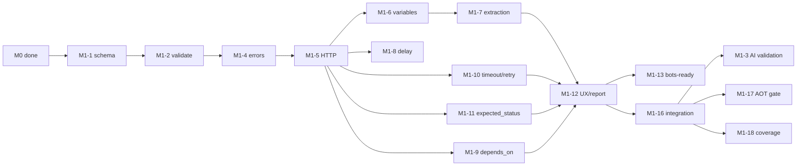

# Milestone 1 — Core Engine: Task Specification

> **Status:** v1.0 · 2026-08-24
> **Purpose.** Defines the concrete tasks and their detailed descriptions required to deliver **Milestone 1 — Core Engine** (README §25 "Milestone 1: Core Engine (CLI)").
> **Tracking.** Task IDs and status checkboxes live in `ROADMAP.md` §5 — it is the single source of truth per its working rules. This document expands each ID into a workable description, acceptance criteria, and dependencies.
> **Inputs.** `README.md` (Milestone 1 Features, AI-friendly principles, out-of-scope) · `ROADMAP.md` §2 (v0.1 baseline audit) · `ROADMAP.md` §3 (ADRs).

---

## 1. Objective

Deliver a **Git-friendly, AI-first, CLI-first** API testing engine that:

- Reads and validates a flat, AI-readable YAML flow format (`metadata` / `functions` / `workflow` / `settings`).
- Executes HTTP steps deterministically: variables, extraction, delays, dependencies, timeouts, retries.
- Fails fast with meaningful, contextual errors — never silent, never generic.
- Publishes as a dependency-free **Native AOT** binary (near-instant startup, zero runtime dependencies).
- Is **AI-generatable**: LLMs can convert OpenAPI specs into flow files that pass `validate` and `run` without manual fixes.
- Emits a machine-readable JSON report — the foundation for M3 (CI/load) and M4 (cloud).

### Out of scope (explicitly deferred)

| Item | Deferred to |
|---|---|
| Bots / parallel execution (`--bots N`, topological parallel branches) | M3-1, M3-6 |
| Load metrics (RPS, p50/p95/p99, error rate) | M3-2 |
| AI error diagnostics (LLM explanation of failures) | M3-5 |
| VS Code extension / Webview UI | M2 |
| Cloud platform, dashboards, distributed load | M4 |

## 2. Prerequisites (Milestone 0 must be complete)

- **M0-1…M0-3** — clean solution layout, exactly one entry point, CLI surface (`tyfapi validate`, `tyfapi run`) with stable exit codes `0` success · `1` execution failed · `2` validation failed · `3` usage error.
- **M0-4** — AD-1 settled (AOT-safe deserialization) and proven with `dotnet publish -c Release`.
- **M0-5** — zero-warning build (`TreatWarningsAsErrors=true`), reproducible pipeline script.
- **AD-6** — recorded for M1: `depends_on` means **strict validation + sequential execution** (parallelism is an M3 concern).

## 3. Baseline gaps this milestone must close (verified in `ROADMAP.md` §2)

| v0.1 gap (evidence) | Fixed by |
|---|---|
| No fail-fast: missing functions / unmet `depends_on` silently skipped | M1-4, M1-9 |
| No HTTP status validation | M1-11 |
| `settings.timeout` & `max_retries` parsed but unused | M1-10 |
| `FunctionDefinition.Baseurl` ignored (engine special-cases `baseUrlDev`) | M1-5 |
| Content-Type stripped and never re-applied on POST bodies | M1-5 |
| `metadata.variables` and env files never seeded into the engine | M1-6 |
| Extraction coerces numbers/booleans to strings | M1-7 |
| No error on unknown `${var}` (silent empty string) | M1-6 |
| Fake handler constructed in tests but never injected; `Assert.True(true)` everywhere | M1-14, M1-15 |
| `PublishAot=true` but reflection-based YamlDotNet deserialization (IL3050) | M0-4, M1-17 |

## 4. Task breakdown

Status legend (see `ROADMAP.md`): `[ ]` TODO · `[~]` IN PROGRESS · `[x]` DONE · `[-]` DEFERRED · `[?]` NEEDS DECISION.

### 4.1 Syntax & validation

#### M1-1 — Formal flow schema specification

**Goal.** Establish the single, authoritative, machine-checkable definition of the flow YAML format.

**Description.**
- Produce `docs/flow-schema.md`: a prose specification plus an embedded JSON Schema (draft 2020-12) covering the full flow document — `metadata` (name, description, environment, api_version, variables), `functions` (HTTP_REQUEST: method, baseurl, endpoint, headers, body, extract, expected_status), `workflow` (function steps with `depends_on`, `DELAY` steps), `settings` (timeout, max_retries).
- Keep the schema flat and AI-friendly (AD-3): minimal nesting, descriptive key names, explicit defaults documented next to each field — this is the surface that LLMs generate against.
- The JSON Schema must be machine-consumable: the M1-2 validator, the M2 Monaco schema service, and any future tooling reference the same artifact.

**Acceptance criteria.**
- [ ] `docs/flow-schema.md` exists with prose + JSON Schema; every sample in `docs/*.yaml` validates against it unchanged.
- [ ] Defaults are documented per field (e.g., `expected_status` = any 2xx, `max_retries` = 0).

**Dependencies.** M0-4 (AD-1 settled — the spec must not contradict the AOT-safe deserialization path).

#### M1-2 — `tyfapi validate`: schema + semantic validation

**Goal.** A full static validation pass that makes the format safe for AI to generate without human review.

**Description.**
- Implement the M0-3 `validate` command: schema conformance per M1-1, then semantic checks:
  - `function_name` referenced in `workflow` but not defined in `functions`;
  - `depends_on` referencing unknown steps, or unsatisfiable dependencies (cycles);
  - duplicate variable names in scope (`metadata.variables`, `extract` targets);
  - malformed JSONPath inside `extract` blocks;
  - invalid HTTP method, missing/invalid `endpoint`, out-of-range delay;
  - missing required sections (`metadata`, `settings`) per the schema.
- Errors are human-readable and pinpoint the offending step/function/field; any violation → exit code `2`.
- An invalid flow must be **unrunnable** — `run` re-invokes the same validation before executing.

**Acceptance criteria.**
- [ ] One negative test per semantic check; every error message includes the element path (e.g., `workflow[3] → depends_on: unknown step 'x'`).
- [ ] `tyfapi run` refuses to execute a flow that fails `validate`.

**Dependencies.** M1-1, M0-3.

#### M1-3 — AI-generation validation (the core requirement)

**Goal.** Prove the format is AI-generatable — the product's first requirement, not an afterthought.

**Description.**
- Prompt **GPT and Claude** to convert **3+ real OpenAPI/Swagger specs** into our flow format, with no manual correction allowed; the result must pass `tyfapi validate` and succeed under `tyfapi run` against the mock API.
- Record the prompt, the generated flow, and the outcome in `docs/ai-validation.md`.
- Treat a model that consistently trips over something as a **spec or error-message bug** (README: "the syntax should allow LLMs to generate without manual fixes") — iterate on the spec/validator, not on the model's output.

**Acceptance criteria.**
- [ ] 3+ specs converted by each of GPT and Claude, all validating and executing green.
- [ ] `docs/ai-validation.md` committed with prompts, flows, and results.

**Dependencies.** M1-1, M1-2, M1-5…M1-7 (runnable engine), M1-16 mock API (may be built ahead of its full acceptance).

#### M1-4 — Error model (fail-fast, contextual, machine-readable)

**Goal.** Every failure is fast, specific, and actionable — the "no silent failures" guarantee of the README.

**Description.**
- Define typed, contextual error types:
  - `FlowValidationError` — static problems; carries the offending path (step/function/field) and, where possible, a suggested fix.
  - `ExecutionError` — runtime failures; carries step id, function name, request summary (method, URL, non-sensitive headers), response status/body, and retry count where applicable.
- **Fail-fast:** the first failing step aborts the flow — never a silent skip (closes the v0.1 gaps where missing functions and unmet `depends_on` were skipped silently).
- Every failure path maps to a stable exit code (M0-3): `1` execution, `2` validation, `3` usage.
- The error payload shape is the future input contract for M3-5 (AI diagnostics) — design it to be serializable.

**Acceptance criteria.**
- [ ] No failure mode exits silently or with a generic message.
- [ ] Error message formats covered by tests; `FlowValidationError`/`ExecutionError` are serializable (JSON) without throwing.

**Dependencies.** M0-3.

### 4.2 Execution engine

#### M1-5 — HTTP step execution (GET/POST/PUT/DELETE)

**Goal.** Correct, observable, AOT-safe HTTP execution — the heart of the engine.

**Description.**
- Execute HTTP functions: GET/POST/PUT/DELETE (+ PATCH/HEAD), against the function's `baseurl` + `endpoint` (closes the v0.1 gap where `FunctionDefinition.Baseurl` was ignored in favor of a special-cased `baseUrlDev`).
- `Content-Type` handling: explicit header wins; JSON default for object bodies — never stripped and lost (v0.1 gap).
- Custom headers including `Authorization`.
- One shared `SocketsHttpHandler` per executor for connection keep-alive (binding convention); `HttpMessageHandler` injectable per AD-4 — no `new HttpClient()` inside engine code.

**Acceptance criteria.**
- [ ] Fake-handler tests assert the **exact** method, URL, headers, and body sent for each request.
- [ ] Per-function `baseurl` respected; `Content-Type` correct for JSON POST and for explicit overrides.

**Dependencies.** M0-4 (AOT-safe deserialization), M1-4.

#### M1-6 — Variable engine (substitution + environment variables)

**Goal.** A single, predictable variable model — including the README feature "Environment variable support".

**Description.**
- `${var}` substitution in `endpoint`, headers, and `body` templates.
- Seed `metadata.variables` and `--env` file into the engine before execution (v0.1 seeded neither).
- Precedence per AD-5: `--set k=v` > env file > `metadata.variables`; **extracted values always overwrite** when a function extracts.
- Unknown `${var}` → `ExecutionError` naming the variable and the step where it appeared (v0.1 substituted silent empty strings).

**Acceptance criteria.**
- [ ] Each precedence tier covered by a test; extraction-overwrite tested.
- [ ] Unknown-variable failure test asserts the variable name and step in the message.

**Dependencies.** M1-4, M1-5.

#### M1-7 — Extraction engine (JSONPath, typed, multi-variable)

**Goal.** Reliable, typed data flow between steps.

**Description.**
- JSONPath extraction: `$.a.b` dot paths and array indexing `$.items[0].name`.
- **Typed extraction:** numbers, booleans, and strings keep their native types; nested objects/arrays are preserved as JSON (v0.1 coerced everything to strings).
- Multi-variable `extract` block — multiple paths per function, one step (README feature "Multi-variable extraction").
- Clear `ExecutionError` when a path is missing or the response is not valid JSON.

**Acceptance criteria.**
- [ ] Unit tests per type (number, boolean, string, nested) and per error case.
- [ ] Integration test: token extracted from a login response arrives in the `Authorization` header of the next step.

**Dependencies.** M1-5, M1-6.

#### M1-8 — DELAY steps

**Goal.** Deterministic, cancellable pacing between steps.

**Description.**
- `DELAY` steps with `duration_seconds` (decimal supported), implemented as a cancellation-aware wait — no busy-wait.
- Bounds sanity-checked by M1-2 validation (≥ 0, sane upper bound).
- Delay steps appear in progress output (M1-12).

**Acceptance criteria.**
- [ ] A 0.5 s delay test asserts elapsed ≥ 500 ms and < ~1.5 s; cancellation test proves the wait is interruptible.

**Dependencies.** M1-5 (step pipeline).

#### M1-9 — `depends_on` (strict, sequential in M1)

**Goal.** Dependencies are enforced, never decorative.

**Description.**
- `depends_on` strictly validated: unknown references and cycles are `FlowValidationError` at `validate` (M1-2) and re-checked at `run` start.
- M1 executes sequentially following the declared dependency order (AD-6: parallelization is deferred to M3-6).
- An unmet dependency at runtime is an `ExecutionError` — never a silent skip (v0.1 gap).

**Acceptance criteria.**
- [ ] Tests for: cycle detection, unknown-reference rejection, and a satisfied-dependency flow that executes in dependency order.

**Dependencies.** M1-2, M1-4, M1-5.

#### M1-10 — Timeouts & retries

**Goal.** `settings` actually controls behavior (v0.1 parsed both and ignored both).

**Description.**
- `settings.timeout`: per-request timeout **and** an overall run timeout — both wired into execution.
- `settings.max_retries`: retry with backoff on 429 / 5xx / timeout; honor `Retry-After` on 429 when present.
- Retry attempts are visible in progress output and included in `ExecutionError` context (attempts performed, last response).

**Acceptance criteria.**
- [ ] Fake-handler tests: 429→429→200 with `max_retries: 2` passes; 500×3 with `max_retries: 2` fails after exactly 3 attempts; per-request timeout fires and is reported.

**Dependencies.** M1-4, M1-5.

#### M1-11 — Response policy (`expected_status`)

**Goal.** A failing HTTP call is a failed flow — the README's first acceptance criterion.

**Description.**
- Per-function `expected_status` (explicit status code or range), defaulting to any 2xx.
- Mismatch → `ExecutionError` carrying response status **and body** — this payload is the input contract for M3-5 (AI diagnostics).
- Fail-fast aborts the flow immediately.

**Acceptance criteria.**
- [ ] Test: expected 200, received 403 → run exits code `1`, message contains status and body.
- [ ] Test: default (no `expected_status`) — 204 and 201 pass, 404 fails.

**Dependencies.** M1-4, M1-5.

#### M1-12 — Console UX & JSON reports

**Goal.** Output that serves both the human running the flow and the machine consuming it.

**Description.**
- Per-step progress line: `step N/M · function · HTTP status · ms`.
- Final summary: pass/fail, total time, extracted variable count.
- `--json-report`: stable, **versioned** machine-readable report — flow metadata, per-step results, timings, extracted variable names, full failure payload (status + body). Schema documented in `docs/json-report-schema.md`; this is the contract M3-2 (CI) and M4 (cloud) build on.

**Acceptance criteria.**
- [ ] JSON report validates against its own documented schema (test).
- [ ] Console formatting covered by tests; report contains the full `ExecutionError` payload on failure.

**Dependencies.** M1-4…M1-11.

#### M1-13 — Bots-ready architecture

**Goal.** Prove now that the engine can be instantiated N times — so M3 load testing is a feature, not a rewrite.

**Description.**
- Execution core: **no static mutable state**, non-blocking awaits, all externals (HTTP, clock, output sink) injectable per AD-4.
- The executor must be safely instantiable N times for concurrent identical flows (the `--bots N` load layer itself is M3-1; M1 only proves the architecture allows it).
- Record the design in `docs/architecture.md` (thread-safety, state isolation, shared handler strategy under concurrency).

**Acceptance criteria.**
- [ ] `docs/architecture.md` committed.
- [ ] Concurrency proof: 20 executor instances over the same flow run simultaneously against the mock API with zero cross-contamination (assert per-instance variable isolation).

**Dependencies.** M1-5…M1-12.

### 4.3 Tests & quality gates

#### M1-14 — Unit tests: parser + validator

**Goal.** The format and its rules are locked down by tests, not by memory.

**Description.**
- Tests for every schema rule (M1-1) and every semantic check (M1-2), plus JSONPath edge cases (M1-7).
- **Real assertions only — no `Assert.True(true)`** (v0.1 test-hygiene gap): each test asserts a concrete value, message, or exit code.

**Acceptance criteria.**
- [ ] Zero `Assert.True(true)`/trivial assertions in the test project.
- [ ] One negative test per semantic check from M1-2.

**Dependencies.** M1-1, M1-2, M1-7.

#### M1-15 — Engine tests (fake handler)

**Goal.** The engine's behavior is pinned to its contract by deterministic tests.

**Description.**
- Inject a fake `HttpMessageHandler` (AD-4) and assert the **exact outgoing request** (method, URL, headers, body) — v0.1 built the fake handler but never injected it.
- Verify extracted variables reach subsequent steps (headers/body) across a multi-step flow.

**Acceptance criteria.**
- [ ] Every engine test goes through the injected handler; no network access in unit tests.
- [ ] Variable-flow test (extract → substitute → send) present and asserting the substituted value on the wire.

**Dependencies.** M1-5…M1-11.

#### M1-16 — Integration tests (in-process mock API)

**Goal.** End-to-end proof: real YAML → real engine → real HTTP → real assertions.

**Description.**
- In-process `HttpListener` mock API implementing at least: login (returns token) → protected endpoint (requires `Authorization`).
- Real `docs/*.yaml` fixtures executed end-to-end through the engine and the CLI surface (`tyfapi run`), asserting exit codes, extracted data, and failure behavior.
- This mock API is the shared harness for M1-3 (AI validation) and M1-17 (AOT smoke).

**Acceptance criteria.**
- [ ] Login→token→protected-endpoint fixture passes end-to-end.
- [ ] A deliberately-failing fixture (401 on protected endpoint) fails with exit code `1` and a body-bearing error.

**Dependencies.** M1-5…M1-11.

#### M1-17 — AOT gate

**Goal.** The "dependency-free binary" claim is enforced, not assumed (v0.1 baseline: IL3050 — a published AOT binary is broken).

**Description.**
- Automated pipeline step: `dotnet publish -c Release -r <rid>` followed by running a smoke flow (M1-16 harness) with the **published binary only** — no dev-time dependencies available.
- Failure of this step fails the build.

**Acceptance criteria.**
- [ ] Published binary executes the smoke flow green on a clean machine/container (no `dotnet` runtime assumption beyond the self-contained binary).
- [ ] Gate wired into the M0-5 pipeline script.

**Dependencies.** M0-4, M1-16 (smoke flow + mock API).

#### M1-18 — Coverage gate

**Goal.** The 80% line-coverage goal on the core engine is measured and enforced.

**Description.**
- Coverlet integrated into the test project; report generated in the pipeline test step (M0-5).
- Threshold: **≥ 80% line coverage on the core engine** (`tyfapi.cli` engine code), enforced by the pipeline script.
- Coverage of the *engine* is the bar — CLI plumbing and test-only code excluded from the denominator.

**Acceptance criteria.**
- [ ] Pipeline fails when core-engine coverage drops below 80%.
- [ ] Current build reports ≥ 80% with the M1-14/M1-15/M1-16 suites.

**Dependencies.** M1-14…M1-16.

---

## 5. README "Milestone 1 Features" coverage map

Every feature in README §25 must be covered by at least one task:

| README feature | Implemented by | Notes |
|---|---|---|
| HTTP execution (GET, POST, PUT, DELETE) | M1-5 | + PATCH/HEAD as bonus methods |
| Variable substitution `${var}` | M1-6 | Unknown var is an error, not empty string |
| Workflow with functions and delays | M1-8, M1-9 | DELAY step + `depends_on` ordering |
| Environment variable support | M1-6 | Precedence fixed by AD-5 |
| Basic JSON response parsing | M1-7 | Typed, non-coercing |
| Variable extraction from responses | M1-7 | JSONPath `$.path.to.value`, `$.items[0].name` |
| Multi-variable extraction | M1-7 | Multiple paths per function, one step |
| Dependency tracking between functions | M1-9 | Strict in M1; parallel in M3-6 |

## 6. Dependencies & suggested execution order

**Recommended sequence (parallelizable work in the same phase):**

1. **Foundation** — M1-1 → M1-2 → M1-4 (spec, validation, error model).
2. **Engine core** — M1-5 → M1-6 → M1-7 → M1-8 → M1-9 → M1-10 → M1-11. Write the M1-14/M1-15 tests *alongside* each task (tests first where practical).
3. **Surface** — M1-12 (console UX + JSON report).
4. **Proof** — M1-16 (mock API + integration tests; can start in phase 2) → M1-3 (AI generation, GPT + Claude) → M1-13 (bots-ready + `docs/architecture.md`).
5. **Gates** — M1-17 (AOT) → M1-18 (coverage) wired into the M0-5 pipeline.

M1-3 is listed in 4.1 but is *executed* late on purpose: it needs a working `validate` + `run` + mock API, and it is the acceptance proof of the whole milestone.

## 7. Definition of Done (Milestone 1)

Milestone 1 is complete when **all** of the following hold:

- [ ] All tasks M1-1…M1-18 are `[x]` in `ROADMAP.md` §5.
- [ ] Every README §25 feature in the coverage map above is implemented and test-covered.
- [ ] `dotnet build` + `dotnet test` pass with zero warnings (M0-5 rules).
- [ ] Core-engine line coverage ≥ 80% (M1-18 gate green).
- [ ] Published Native AOT binary executes the smoke flow green (M1-17 gate green).
- [ ] GPT and Claude each converted 3+ OpenAPI specs to passing flows with no manual fixes (M1-3, `docs/ai-validation.md`).
- [ ] `docs/flow-schema.md`, `docs/json-report-schema.md`, `docs/architecture.md` committed.
- [ ] No silent failure mode remains: every error is contextual, exit codes stable (M1-4).
- [ ] Changelog entry recorded in `ROADMAP.md` §11.

## 8. Tracking rules

- Update task status in **`ROADMAP.md` §5 only** (`[ ]` → `[~]` → `[x]`); this document never tracks status.
- Any new requirement discovered during implementation is appended to `ROADMAP.md` before implementation starts (its working rules).
- Scope changes to tasks in this document get a note in `ROADMAP.md` §11 (Changelog).
- Deferred items (bots, load metrics, AI diagnostics) stay **out** of this milestone — no partial implementations.

